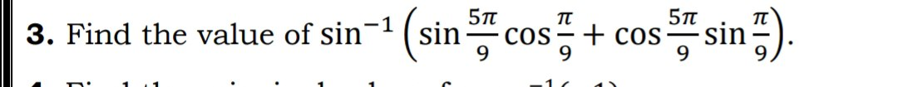

1.paste- question images to "qtn_imgs" name called folder as per the doc image.

2. src='../qtn_imgs/paste-image name with file extension'

3.Looks like

									 ---^^^^^^---
										 {q1.jpg}-image name with extension

4.And last paste-  tag in "question input felid or options felid." Where you want.(question Object Generator).

*img tag Structure same exact
